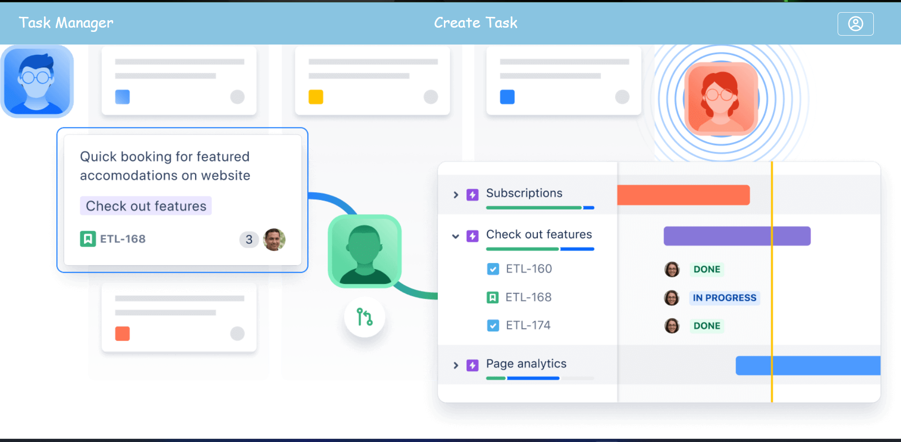
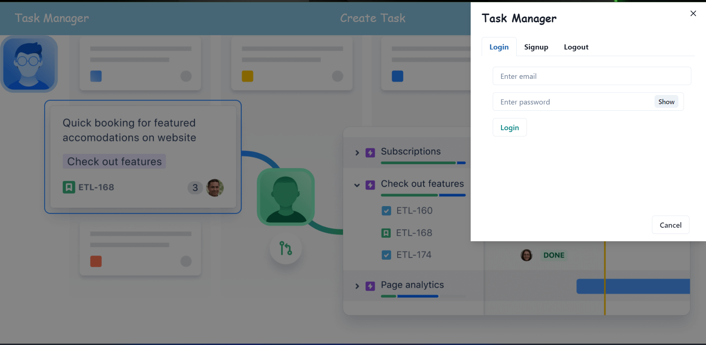
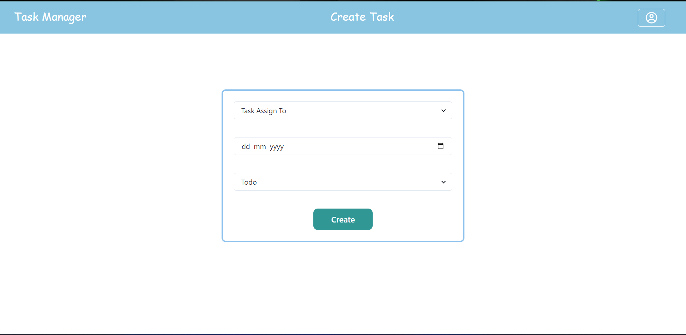
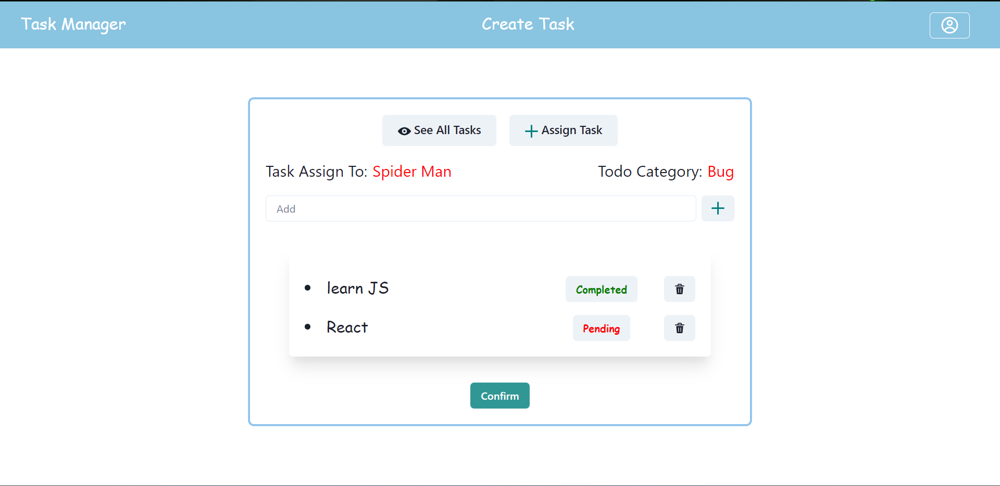

# Task Manager

Task Manager helps your software teams find, track, and record bugs in their software. A good bug or issue tracking tool like Task Manager gives your team a view of all the items in your backlog, including bugs and project tasks.

#### <a href="https://taskmanager-puce.vercel.app/">Click to see Live Demo</a>

